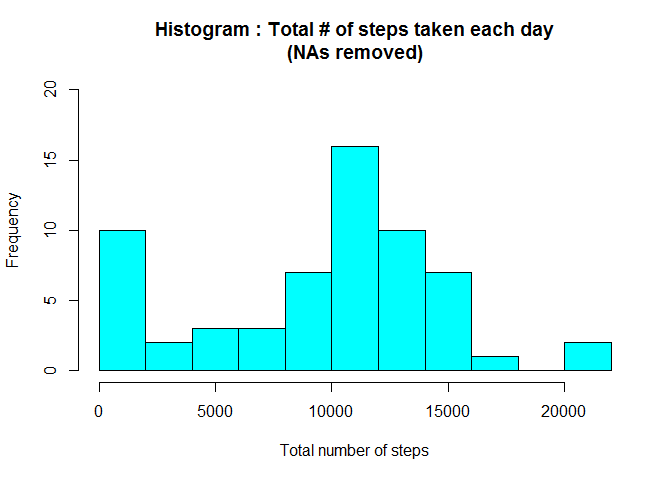
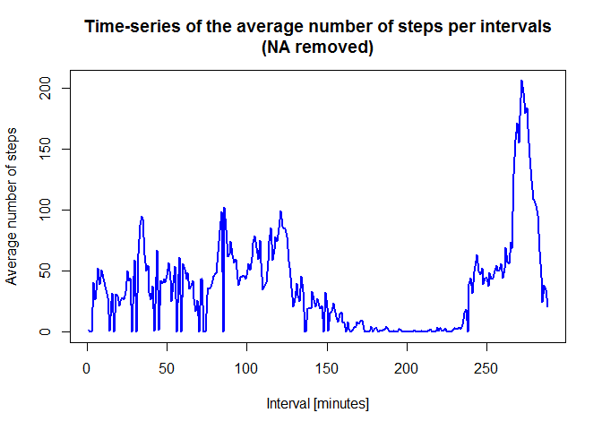
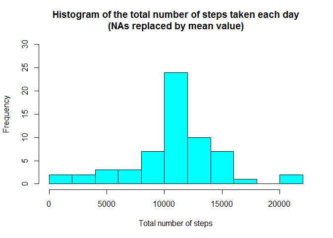
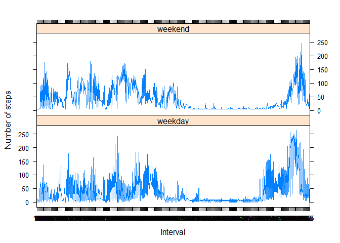

# Reproducible Research: Peer Assessment 1
---------------------------------------------------
#### Author : Vijay kumar Vidyadharan       
#### Date : 14th Jun 2015    


**Introduction**

It is now possible to collect a large amount of data about personal movement using activity monitoring devices such as a Fitbit, Nike Fuelband, or Jawbone Up. These type of devices are part of the "quantified self" movement - a group of enthusiasts who take measurements about themselves regularly to improve their health, to find patterns in their behavior, or because they are tech geeks. But these data remain under-utilized both because the raw data are hard to obtain and there is a lack of statistical methods and software for processing and interpreting the data.

This assignment makes use of data from a personal activity monitoring device. This device collects data at 5 minute intervals through out the day. The data consists of two months of data from an anonymous individual collected during the months of October and November, 2012 and include the number of steps taken in 5 minute intervals each day.


**Data**

The data for this assignment was avaiable in GitHub repository hence was not downloaded from below :

Dataset: [Activity monitoring data](https://d396qusza40orc.cloudfront.net/repdata%2Fdata%2Factivity.zip) [52K]
The variables included in this dataset are:

steps: Number of steps taking in a 5-minute interval (missing values are coded as NA)
date: The date on which the measurement was taken in YYYY-MM-DD format
interval: Identifier for the 5-minute interval in which measurement was taken

The dataset is stored in a comma-separated-value (CSV) file and there are a total of 17,568 observations in this dataset.


## Loading and preprocessing the data


```r
# Unzip data file in current working directory
unzip("activity.zip")

# Read data from csv
data <- read.csv("activity.csv", colClasses = c("integer", "Date", "factor"))
head(data)
```

```
##   steps       date interval
## 1    NA 2012-10-01        0
## 2    NA 2012-10-01        5
## 3    NA 2012-10-01       10
## 4    NA 2012-10-01       15
## 5    NA 2012-10-01       20
## 6    NA 2012-10-01       25
```

```r
dim(data)
```

```
## [1] 17568     3
```

```r
# Get weekdays from the dates
data <- data.frame(date=data$date, 
                   weekday=tolower(weekdays(data$date)), 
                   steps=data$steps, 
                   interval=data$interval)


# Check for weekend or weekday
data <- cbind(data, daytype=ifelse(data$weekday == "saturday" | data$weekday == "sunday", 
                                   "weekend", 
                                   "weekday")
              )

# Create the final data.frame
data_final <- data.frame(date=data$date, 
                        weekday=data$weekday, 
                        daytype=data$daytype, 
                        interval=data$interval,
                        steps=data$steps)

# Clear 'data' from the workspace once we have data_final
rm(data)

# Check first few records & summary
head(data_final)
```

```
##         date weekday daytype interval steps
## 1 2012-10-01  monday weekday        0    NA
## 2 2012-10-01  monday weekday        5    NA
## 3 2012-10-01  monday weekday       10    NA
## 4 2012-10-01  monday weekday       15    NA
## 5 2012-10-01  monday weekday       20    NA
## 6 2012-10-01  monday weekday       25    NA
```

```r
summary(data_final)
```

```
##       date                 weekday        daytype         interval    
##  Min.   :2012-10-01   friday   :2592   weekday:12960   0      :   61  
##  1st Qu.:2012-10-16   monday   :2592   weekend: 4608   10     :   61  
##  Median :2012-10-31   saturday :2304                   100    :   61  
##  Mean   :2012-10-31   sunday   :2304                   1000   :   61  
##  3rd Qu.:2012-11-15   thursday :2592                   1005   :   61  
##  Max.   :2012-11-30   tuesday  :2592                   1010   :   61  
##                       wednesday:2592                   (Other):17202  
##      steps       
##  Min.   :  0.00  
##  1st Qu.:  0.00  
##  Median :  0.00  
##  Mean   : 37.38  
##  3rd Qu.: 12.00  
##  Max.   :806.00  
##  NA's   :2304
```


## What is mean total number of steps taken per day?
We will ignore the missing values in the dataset and calculate the total steps per day

```r
# Calculate total steps taken each day; NAs are removed
total_steps_daily <- aggregate(data_final$steps, by=list(data_final$date), FUN=sum, na.rm=TRUE)

# Rename the attributes
names(total_steps_daily) <- c("date", "total")

# Plot the histogram of the total steps taken each day
hist(total_steps_daily$total, 
     breaks=seq(from=0, to=22000, by=2000),
     col="cyan", 
     xlab="Total number of steps", 
     ylim=c(0, 20), 
     main="Histogram : Total # of steps taken each day\n(NAs removed)")
```

 


## What is the average daily activity pattern?

```r
# Compute mean
mean(total_steps_daily$total)
```

[1] 9354.23

```r
# Compute median
median(total_steps_daily$total)
```

[1] 10395


## What is the average daily activity pattern?

```r
# Compute the means of steps accross all days for each interval
avg_data <- aggregate(data_final$steps, 
                       by=list(as.numeric(data_final$interval)), 
                       FUN=mean, 
                       na.rm=TRUE)

# Rename the attributes
names(avg_data) <- c("interval", "mean")

# Make a time series plot (i.e. type = "l") of the 5-minute interval (x-axis) and the average # # number of steps taken, averaged across all days (y-axis)

# Compute the time series plot
plot(avg_data$interval, 
     avg_data$mean, 
     type="l", 
     col="blue", 
     lwd=2, 
     xlab="Interval [minutes]", 
     ylab="Average number of steps", 
     main="Time-series of the average number of steps per intervals\n(NA removed)")
```

 

```r
# Which 5-minute interval, on average across all the days in the dataset, contains the maximum 
# number of steps?

# Find the position of the maximum mean
max_avg_pos <- which(avg_data$mean == max(avg_data$mean))

# Get the value of interval at above position
max_avg_interval <- avg_data[max_avg_pos, 1]
```

## Inputing missing values
1.Calculate and report the total number of missing values in the dataset (i.e. the total number of rows with NA's)

```r
# Get count of NAs.
NA_count <- sum(is.na(data_final$steps))
NA_count
```

```
## [1] 2304
```


2.Devise a strategy for filling in all of the missing values in the dataset. The strategy does not need to be sophisticated. For example, you could use the mean/median for that day, or the mean for that 5-minute interval, etc.

```r
# Find all the NA positions
na_pos <- which(is.na(data_final$steps))

# Create a vector of means/averages of same lenght as length of NAs
mean_vec <- rep(mean(data_final$steps, na.rm=TRUE), times=length(na_pos))
```


3.Create a new dataset that is equal to the original dataset but with the missing data filled in

```r
# Create new dataset
data_new <- data_final

# Replace the NAs by the means
data_new[na_pos, "steps"] <- mean_vec

#Check few rows of newly created dataset 
head(data_new)
```

```
##         date weekday daytype interval   steps
## 1 2012-10-01  monday weekday        0 37.3826
## 2 2012-10-01  monday weekday        5 37.3826
## 3 2012-10-01  monday weekday       10 37.3826
## 4 2012-10-01  monday weekday       15 37.3826
## 5 2012-10-01  monday weekday       20 37.3826
## 6 2012-10-01  monday weekday       25 37.3826
```

4.Make a histogram of the total number of steps taken each day and Calculate and report the mean and median total number of steps taken per day. Do these values differ from the estimates from the first part of the assignment? What is the impact of imputing missing data on the estimates of the total daily number of steps?

```r
#Compute the total number of steps each day (NA values removed)
sum_steps <- aggregate(data_new$steps, by=list(data_new$date), FUN=sum)

# Rename the attributes
names(sum_steps) <- c("date", "total")

# Compute the histogram of the total number of steps each day
hist(sum_steps$total, 
     breaks=seq(from=0, to=22000, by=2000),
     col="cyan", 
     xlab="Total number of steps", 
     ylim=c(0, 30), 
     main="Histogram of the total number of steps taken each day\n(NAs replaced by mean value)")
```

 

```r
#Calculate mean
mean(sum_steps$total)
```

```
## [1] 10766.19
```

```r
#Calculate median
median(sum_steps$total)
```

```
## [1] 10766.19
```

## Are there differences in activity patterns between weekdays and weekends?

1.Create a new factor variable in the dataset with two levels - "weekday" and "weekend" indicating whether a given date is a weekday or weekend day.
```{R}
# This variable has already been created during the initially itself.
# Check the 'data_final'
head(data_final)
```

2.Make a panel plot containing a time series plot (i.e. type = "l") of the 5-minute interval (x-axis) and the average number of steps taken, averaged across all weekday days or weekend days (y-axis).

```r
# Load the lattice graphical library
library(lattice)

# Compute the average number of steps taken, averaged across all daytype variable
avg_data <- aggregate(data_new$steps, 
                       by=list(data_new$daytype, 
                       data_new$weekday, 
                       data_new$interval), mean)

# Rename the attributes
names(avg_data) <- c("daytype", "weekday", "interval", "mean")

#Check first few rows
head(avg_data)
```

```
##   daytype  weekday interval     mean
## 1 weekday   friday        0 8.307244
## 2 weekday   monday        0 9.418355
## 3 weekend saturday        0 4.672825
## 4 weekend   sunday        0 4.672825
## 5 weekday thursday        0 9.375844
## 6 weekday  tuesday        0 0.000000
```


```r
# Time series plot
xyplot(mean ~ interval | daytype, avg_data, 
       type="l", 
       lwd=1, 
       xlab="Interval", 
       ylab="Number of steps", 
       layout=c(1,2))
```

 
